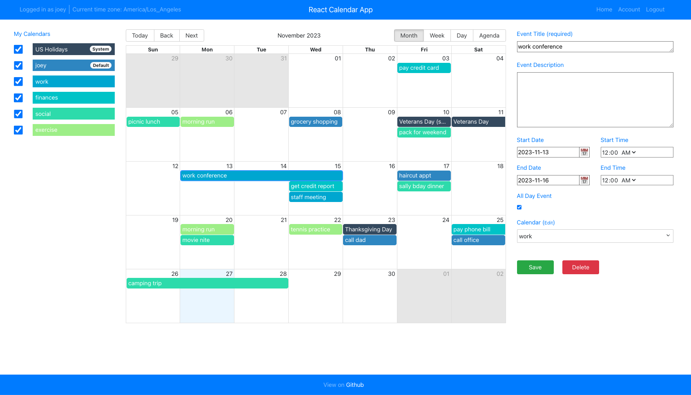
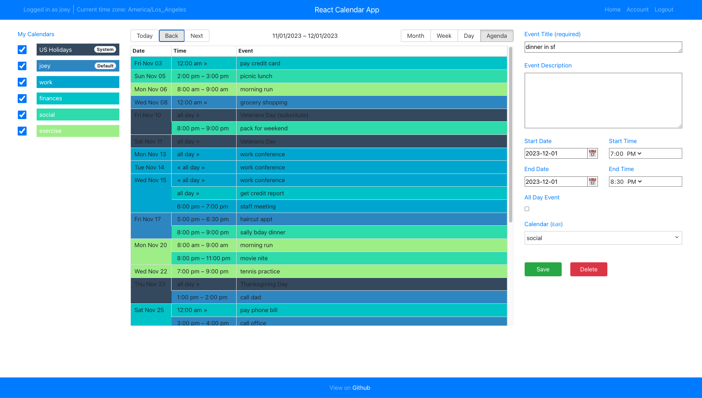

# React Calendar





## Description

**React Calendar** is an easy-to-use online calendar built with [React Big Calendar](https://jquense.github.io/react-big-calendar/examples/index.html?path=/story/about-big-calendar--page). This full-stack demo showcases how to integrate a complex third-party UI library with the popular "MERN" development framework. The project includes key architectural elements like Mongoose, Redux, and JSON Web Token (JWT) to scale functionality easily. It utilizes public data from the [Calendarific Holidays API](https://calendarific.com/api-documentation).

---

### MERN Stack

React Calendar is a prime example of a **MERN stack** application, which consists of the following technologies:

- **MongoDB**: A document-based open-source database.
- **Express**: A web application framework for Node.js.
- **React**: A JavaScript front-end library for building user interfaces.
- **Node.js**: A JavaScript runtime environment that executes JavaScript code outside the browser.

The MERN stack allows for rapid development and ease of maintenance of full-stack web apps. To learn more, check out this [YouTube tutorial](https://www.youtube.com/watch?v=7CqJlxBYj-M).

---

## File Structure

```bash
src
├── config              # Configuration files for the app
├── client              # Frontend files
│   ├── assets          # Static assets (e.g. images)
│   ├── components      # Reusable React components
│   ├── pages           # Page-level components
│   ├── store           # Redux store and actions
│   ├── styles          # CSS Modules for styling
│   ├── utils           # Utility functions
│   ├── App.js          # Main React entry point
│   ├── index.html      # HTML template
│   ├── index.css       # Global styles
│   ├── index.js        # Entry point for React app
│   └── validation.js   # Form validation utilities
├── server              # Backend files
│   ├── controllers     # Express.js controllers
│   ├── db              # Database connection files
│   ├── middleware      # Middleware for Express.js
│   ├── models          # MongoDB database models
│   ├── routers         # Express.js route definitions
│   ├── services        # Services for data handling
│   └── utils           # Backend utility functions
├── .babelrc            # Babel.js configuration
├── .env.example        # Sample environment variables file
├── .gitignore          # Files to exclude from version control
├── .prettierrc         # Prettier.js configuration
├── .jest.config.js     # Jest.js configuration
├── .seedHolidayEvents.js # Script for seeding events to the DB
├── .webpack.development.js # Webpack configuration for dev mode
├── .webpack.production.js # Webpack configuration for prod mode
└── README.md           # This file
```

## 🚀 Initial Setup

React Calendar was built using **Node.js v16**. For the best compatibility, it's recommended to install a **long-term support (LTS)** version of Node.js.

### Installation Instructions

1. **Download and Install Node.js:** [Node.js Official Website](https://nodejs.org/)
2. **Verify Installation:**
   ```bash
   node -v
   ```

## 🌱 Environment Variables

Create the following configuration files in the project root:

- `.env.development`
- `.env.production`

Refer to `.env.example` for sample values. Add the following environment variables:

| Variable | Description |
|----------|-------------|
| `PORT` | Port where the app will run |
| `MONGO_HOSTNAME` | Mongo host (e.g., localhost for dev) |
| `MONGO_PORT` | Mongo port (e.g., 27017) |
| `MONGO_DB` | Mongo database name |
| `API_URL` | Base API URL (e.g., `http://localhost:3001/api`) |
| `CALENDARIFIC_KEY` | Calendarific API Key |
| `JWT_SECRET_KEY` | JWT Private Key |
| `JWT_EXPIRATION` | JWT expiration (seconds) |
| `JWT_REFRESH_EXPIRATION` | JWT refresh expiration (seconds) |

## 🗄️ MongoDB Setup

React Calendar works best with **MongoDB v4.4.6**, though external instances are supported.

1. **Install MongoDB:** [Download MongoDB](https://www.mongodb.com/try/download)
2. **Start MongoDB:**
   ```bash
   mongod
   ```
3. **Create Database:**
   ```bash
   mongo
   use reactcalendar_db
   db.app.insert({ _id: 1, message: "first doc" })
   ```

Verify your database using tools like [DbGate](https://dbgate.org) or [Robo 3T](https://robomongo.org/).

## 🌱 Seeding the Database

Seed default calendar events:

```bash
node seedHolidayEvents.js
```

Expected Output:
- `Connected correctly to server`
- `Database seeded!`

Verify data in the `events` collection.

## 🚀 Running the App

### Production Mode
1. **Build Production Assets:**
   ```bash
   npm run build
   ```
2. **Start the App:**
   ```bash
   npm run start
   ```

#### Process Manager (PM2)
To run with PM2:
```bash
npm install pm2 -g
npm run pm2
```

### Development Mode
```bash
npm run dev
```
Expected Output: `Server started at http://localhost:3001`

Access the frontend at [http://localhost:8080](http://localhost:8080).

## 🔐 Authentication & Authorization

### JSON Web Token (JWT)
React Calendar uses **JWT** for authentication.
- Faster database interactions
- Better scalability
- Portability across services

Environment Variable:
- `JWT_SECRET_KEY`: Used as the private key for JWT.

### User Roles
Each user document contains roles (`user`, `moderator`, or `admin`). These can be used to implement authorization if needed.

## 🖥️ Frontend: React & Redux

The frontend is a **Single-Page Application (SPA)** using React and Redux:

- **Routing:** Client-side routing via `React Router`
- **Data Storage:** Persistent state with Redux and `localStorage`

If the app appears out of sync, clear `localStorage.state` and reload.

## 🎨 Styling with CSS Modules

Components use **CSS Modules** for styling:

- Modular and reusable styles
- Locally-scoped class names

## ⚙️ Additional Notes

- Ensure `.env.production` contains all environment variables before building.
- To disable Hot Module Reloading (HMR) in development, remove `hot: true` from `webpack.development.js`.

---

💻 **Happy Coding!** 🎉
